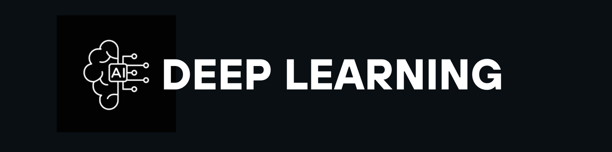
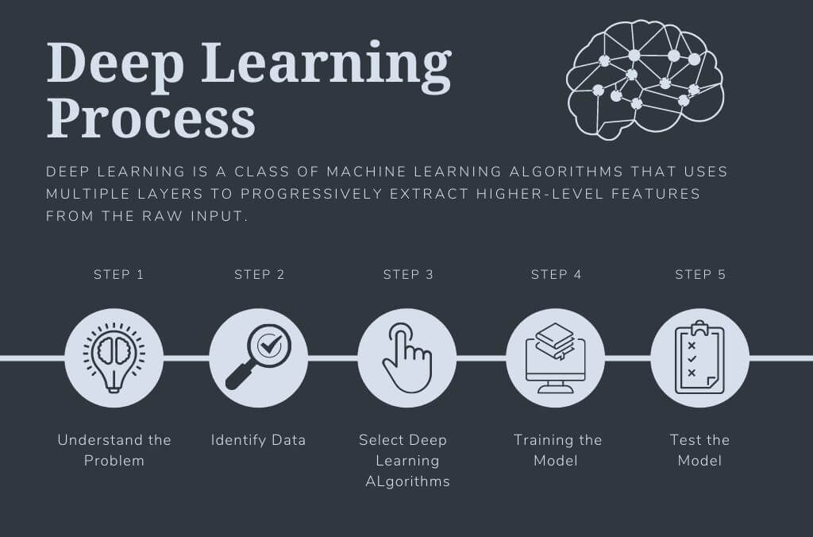

*From Transformers to Production - A comprehensive guide to deep learning concepts and implementation*

## Overview

A structured learning path covering fundamental mathematics to production-ready deep learning systems. This repository provides hands-on notebooks and implementations for building modern AI applications.

## Learning Path

Follow the numbered directories in sequence for a structured learning experience: 

| Module | Description |
|--------|-------------|
| **1. Math** | Linear algebra, calculus, and probability fundamentals |
| **2. PyTorch** | Framework essentials and tensor operations |
| **3. Neural Networks** | Architecture design and implementation from scratch |
| **4. Transformers** | Attention mechanisms and modern NLP models |
| **5. RAG** | Building retrieval-augmented generation systems |
| **6. OCR** | Computer vision and text recognition applications |

---

  

  Built with ❤️ by <a href="https://github.com/CipherSingularity">CipherSingularity</a>

