<div align="center"> 
  
#  Deep Learning Journey

[](https://www.python.org/)
[](https://pytorch.org/)
[](https://www.tensorflow.org/)
[](LICENSE)
[]()

*A comprehensive repository documenting my deep learning journey with implementations, concepts, and practical projects.*

----

## 📚 Learning Path

| Phase | Topic | Time | Priority | Status |
|-------|-------|------|----------|--------|
| **Phase 1** | Neural Network Foundations | 2-3 weeks | 🔴 Critical | ⬜ |
| **Phase 2** | CNNs | 2-3 weeks | 🟠 High | ⬜ |
| **Phase 3** | Transformers | 3-4 weeks | 🔴 Critical | ⬜ |
| **Phase 4** | Generative AI | 3-4 weeks | 🔴 Critical | ⬜ |
| **Phase 5** | Training & Deployment | 2 weeks | 🟠 High | ⬜ |
| **Phase 6** | RNNs (Optional) | 1-2 weeks | 🟡 Medium | ⬜ |
| **Phase 7** | Reinforcement Learning | 2-3 weeks | 🟠 High | ⬜ |
| **Phase 8** | Explainable AI | 1-2 weeks | 🟡 Medium | ⬜ |
| **Phase 9** | Advanced Topics | 2-3 weeks | 🟢 Low | ⬜ |
| **Phase 10** | Real-World Projects | Ongoing | 🔴 Critical | ⬜ |

</div>

---

### 📋 Detailed Topics


<details>
<summary><b>1️⃣ Neural Network Foundations</b></summary>

- [ ] Perceptron & Multi-Layer Perceptron (MLP)
- [ ] Activation Functions (ReLU, Sigmoid, Tanh)
- [ ] Loss Functions & Optimizers (SGD, Adam)
- [ ] Backpropagation Algorithm

**Resources:**
- [3Blue1Brown - Neural Networks](https://www.youtube.com/playlist?list=PLZHQObOWTQDNU6R1_67000Dx_LFXUL5VL)
- [Fast.ai Course](https://www.fast.ai/)

</details>

<details>
<summary><b>2️⃣ Convolutional Neural Networks (CNNs)</b></summary>

- [ ] Convolution & Pooling Operations
- [ ] Architecture: ResNet, VGG, EfficientNet
- [ ] Object Detection (YOLO, R-CNN)
- [ ] Image Segmentation (U-Net, Mask R-CNN)

**Resources:**
- [CS231n: Convolutional Neural Networks](http://cs231n.stanford.edu/)
- [PyTorch Vision Tutorial](https://pytorch.org/vision/stable/index.html)

</details>

<details>
<summary><b>3️⃣ Recurrent Neural Networks (RNNs)</b></summary>

- [ ] LSTM & GRU Architectures
- [ ] Sequence Modeling & NLP
- [ ] Time-Series Forecasting
- [ ] Attention Mechanisms

**Resources:**
- [Colah's LSTM Blog](http://colah.github.io/posts/2015-08-Understanding-LSTMs/)
- [Sequence-to-Sequence Models](https://arxiv.org/abs/1409.3215)

</details>

<details>
<summary><b>4️⃣ Transformers ⭐ (Most Important)</b></summary>

- [ ] Self-Attention Mechanism
- [ ] Multi-Head Attention
- [ ] Large Language Models (GPT, LLaMA, BERT)
- [ ] Vision Transformers (ViT)

**Resources:**
- [Attention Is All You Need Paper](https://arxiv.org/abs/1706.03762)
- [HuggingFace Transformers](https://huggingface.co/transformers/)

</details>

<details>
<summary><b>5️⃣ Generative AI 🔥</b></summary>

- [ ] Generative Adversarial Networks (GANs)
- [ ] Diffusion Models (DDPM, Stable Diffusion)
- [ ] Text-to-Image Generation
- [ ] Fine-Tuning & LoRA Techniques

**Resources:**
- [Diffusion Models Explained](https://lilianweng.github.io/posts/2021-07-11-diffusion-models/)
- [Stable Diffusion Repository](https://github.com/CompVis/stable-diffusion)

</details>

<details>
<summary><b>6️⃣ Reinforcement Learning</b></summary>

- [ ] Q-Learning & Deep Q-Networks (DQN)
- [ ] Policy Gradients (REINFORCE, A3C)
- [ ] PPO & RLHF (Reinforcement Learning from Human Feedback)

**Resources:**
- [OpenAI Spinning Up](https://spinningup.openai.com/)
- [Deep Reinforcement Learning Course](https://www.deeplearningai.com/)

</details>

<details>
<summary><b>7️⃣ Training & Deployment</b></summary>

- [ ] Hyperparameter Tuning & Grid Search
- [ ] Model Quantization & Pruning
- [ ] MLOps, CI/CD, Model Monitoring
- [ ] Docker & Kubernetes for ML

**Resources:**
- [Made With ML](https://madewithml.com/)
- [MLOps.community](https://mlops.community/)

</details>

<details>
<summary><b>8️⃣ Explainable AI</b></summary>

- [ ] SHAP (SHapley Additive exPlanations)
- [ ] LIME (Local Interpretable Model-agnostic Explanations)
- [ ] Feature Attribution Methods
- [ ] Model Interpretability

**Resources:**
- [SHAP GitHub](https://github.com/slundberg/shap)
- [LIME Paper](https://arxiv.org/abs/1602.04938)

</details>

<details>
<summary><b>9️⃣ Advanced Concepts</b></summary>

- [ ] Meta-Learning (Learning to Learn)
- [ ] Contrastive Learning (SimCLR, MoCo)
- [ ] Multimodal Vision-Language Models (CLIP, LLaVA)
- [ ] Few-Shot & Zero-Shot Learning

**Resources:**
- [OpenAI CLIP](https://github.com/openai/CLIP)
- [Meta-Learning Research](https://arxiv.org/abs/1810.03548)

</details>

<details>
<summary><b>🔟 Real-World Applications</b></summary>

- [ ] Natural Language Processing (NLP)
- [ ] Computer Vision Applications
- [ ] Healthcare AI & Medical Imaging
- [ ] Finance & Fraud Detection
- [ ] Recommendation Systems

**Projects:**
- Build a chatbot with LLMs
- Create an image classifier
- Develop a recommendation engine
- Medical image segmentation

</details>

---

<div align="center"> 

## 🛠️ Tech Stack

### Core Frameworks


### Programming & Data Science


### Visualization


### Development Tools


### MLOps & Deployment


### Experiment Tracking & Cloud


### Specialized Libraries


</div>

## 📂 Repository Structure

```
├── 01-fundamentals/          # Neural network basics
├── 02-cnns/                  # Convolutional networks
├── 03-rnns/                  # Recurrent networks
├── 04-transformers/          # Transformer models
├── 05-generative-ai/         # GANs, Diffusion, LLMs
├── 06-reinforcement-learning/# RL implementations
├── 07-deployment/            # MLOps & model serving
├── 08-explainable-ai/        # XAI techniques
├── 09-advanced/              # Advanced topics
├── 10-projects/              # Real-world projects
└── resources/                # Papers, notes, datasets
```

## 🚀 Getting Started

```bash
# Clone the repository
git clone https://github.com/yourusername/deep-learning.git

# Navigate to the directory
cd deep-learning-journey

# Install dependencies
pip install -r requirements.txt

# Launch Jupyter Notebook
jupyter notebook
```
<br>

<div align="center">

```
                         START HERE

    ├─── 1️⃣ NEURAL NETWORK FOUNDATIONS ─────────────────────────┐
    │    • Perceptron & MLP                                     │
    │    • Activation Functions (ReLU, Sigmoid, GELU)           │
    │    • Loss Functions & Optimizers (SGD, Adam, AdamW)       │
    │    • Backpropagation & Gradient Descent                   │
    │                                                           │
    ├─── 2️⃣ CNNs ───────────────────────────────────────────────┤
    │    • Convolution & Pooling                                │
    │    • ResNet, VGG, EfficientNet                            │
    │    • Object Detection (YOLO, Faster R-CNN)                │
    │    • Image Segmentation (UNet, Mask R-CNN)                │
    │                                                           │
    ├─── 3️⃣ RNNs ──────────────────────────────────────────────┤
    │    • LSTM & GRU                                           │
    │    • Sequence Modeling                                    │
    │    • Time-Series Forecasting                              │
    │                                                           │
    ├─── 4️⃣ TRANSFORMERS ⭐ (MOST IMPORTANT) ──────────────────┤
    │    • Self-Attention & Multi-Head Attention                │
    │    • Positional Encoding                                  │
    │    • LLMs: GPT, LLaMA, BERT                               │
    │    • Vision Transformers (ViT)                            │
    │                                                           │
    ├─── 5️⃣ GENERATIVE AI 🔥 (TOP SKILL 2025) ─────────────────┤
    │    • GANs (DCGAN, StyleGAN)                               │
    │    • Diffusion Models (Stable Diffusion, FLUX)            │
    │    • Text-to-Image & Text-to-Video                        │
    │    • Prompt Engineering & Fine-Tuning (LoRA, PEFT)        │
    │                                                           │
    ├─── 6️⃣ REINFORCEMENT LEARNING ────────────────────────────┤
    │    • Q-Learning & Deep Q-Networks (DQN)                   │
    │    • Policy Gradients (PPO, A3C, SAC)                     │
    │    • RLHF (Reinforcement Learning from Human Feedback)    │
    │                                                           │
    ├─── 7️⃣ TRAINING & DEPLOYMENT 🚢 ──────────────────────────┤
    │    • Hyperparameter Tuning & Regularization               │
    │    • Quantization, Pruning, Distillation                  │
    │    • MLOps (MLflow, Kubernetes, Docker)                   │
    │    • Model Formats (ONNX, TensorRT)                       │
    │                                                           │
    ├─── 8️⃣ EXPLAINABLE AI 🔍 ─────────────────────────────────┤
    │    • SHAP & LIME                                          │
    │    • Integrated Gradients                                 │
    │    • Feature Attribution Methods                          │
    │                                                           │
    ├─── 9️⃣ ADVANCED CONCEPTS 🎓 ──────────────────────────────┤
    │    • Meta-Learning (MAML)                                 │
    │    • Contrastive Learning (SimCLR, CLIP)                  │
    │    • Multimodal Learning (VLMs)                           │
    │    • Federated Learning                                   │
    │                                                           │
    └─── 🔟 REAL-WORLD APPLICATIONS 💼 ────────────────────────┘
    |     • NLP & Computer Vision                               │
    |     • Healthcare & Finance AI                             │
    |     • Recommendation Systems                              │
    |     • Speech Processing                                   │
    └───────────────────────────────────────────────────────────┘ 

```
</div>





```mermaid
graph TD
    Start([🚀 Start Here]) --> Spacer1[ ]
    Spacer1 --> A[1️⃣ Neural Network Foundations]
    
    A --> A1[Perceptron & MLP]
    A --> A2[Activation Functions]
    A --> A3[Loss Functions & Optimizers]
    A --> A4[Backpropagation]
    
    A --> Spacer2[ ]
    Spacer2 --> B[2️⃣ CNNs]
    B --> B1[Convolution & Pooling]
    B --> B2[ResNet, VGG, EfficientNet]
    B --> B3[Object Detection]
    B --> B4[Image Segmentation]
    
    A --> C[3️⃣ RNNs]
    C --> C1[LSTM & GRU]
    C --> C2[Sequence Modeling]
    C --> C3[Time-Series]
    
    B --> Spacer3[ ]
    Spacer3 --> D[4️⃣ Transformers ⭐]
    C --> D
    D --> D1[Self-Attention]
    D --> D2[Multi-Head Attention]
    D --> D3[LLMs: GPT, LLaMA]
    D --> D4[Vision Transformers]
    
    D --> Spacer4[ ]
    Spacer4 --> E[5️⃣ Generative AI 🔥]
    E --> E1[GANs & StyleGAN]
    E --> E2[Diffusion Models]
    E --> E3[Text-to-Image]
    E --> E4[Fine-Tuning & LoRA]
    
    A --> F[6️⃣ Reinforcement Learning]
    F --> F1[Q-Learning & DQN]
    F --> F2[Policy Gradients]
    F --> F3[PPO & RLHF]
    
    D --> G[7️⃣ Training & Deployment]
    E --> G
    G --> G1[Hyperparameter Tuning]
    G --> G2[Quantization & Pruning]
    G --> G3[MLOps & CI/CD]
    
    G --> Spacer5[ ]
    Spacer5 --> H[8️⃣ Explainable AI]
    H --> H1[SHAP & LIME]
    H --> H2[Feature Attribution]
    
    D --> I[9️⃣ Advanced Concepts]
    E --> I
    I --> I1[Meta-Learning]
    I --> I2[Contrastive Learning]
    I --> I3[Multimodal VLMs]
    
    B --> J[🔟 Real-World Applications]
    D --> J
    E --> J
    F --> J
    J --> J1[NLP & Computer Vision]
    J --> J2[Healthcare & Finance]
    J --> J3[Recommendation Systems]
    
    J --> Spacer6[ ]
    Spacer6 --> End([🎯 Job Ready!])
    
    style Start fill:#4CAF50,stroke:#2E7D32,color:#fff
    style A fill:#2196F3,stroke:#1565C0,color:#fff
    style D fill:#FF9800,stroke:#E65100,color:#fff
    style E fill:#F44336,stroke:#C62828,color:#fff
    style G fill:#9C27B0,stroke:#6A1B9A,color:#fff
    style J fill:#00BCD4,stroke:#00838F,color:#fff
    style End fill:#4CAF50,stroke:#2E7D32,color:#fff
    style Spacer1 fill:none,stroke:none
    style Spacer2 fill:none,stroke:none
    style Spacer3 fill:none,stroke:none
    style Spacer4 fill:none,stroke:none
    style Spacer5 fill:none,stroke:none
    style Spacer6 fill:none,stroke:none

```

## 📧 Contact

- GitHub: [@ARUNAGIRINATHAN-K](https://github.com/ARUNAGIRINATHAN-K)
- LinkedIn: [arunagirinathan-k](https://linkedin.com/in/arunagirinathan-k)

---
<div align="center"> 
  
⭐ **Star this repo** if you find it helpful! Happy Learning! 🚀

</div>

<!--
Once you've completed all sections, you'll be prepared for:
- **ML Engineer** roles
- **AI/ML Research** positions
- **Data Science** careers
- **ML DevOps** opportunities
-->


